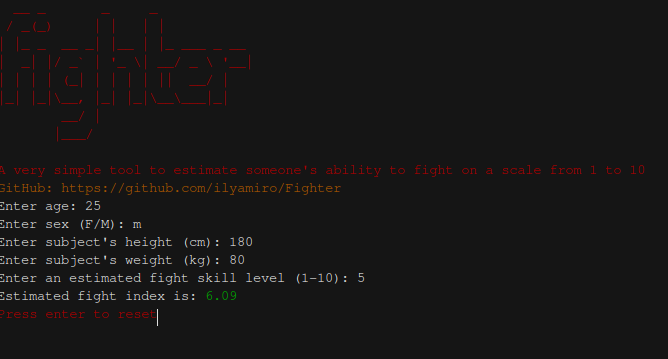

# Fight indexer
A simple tool to estimate someone's ability to fight by certain parameters 



### Installation:
```
git clone https://github.com/ilyamiro/Fighter.git
cd Fighter
python fighter.py
```
You don't need any dependencies to run it. Just clone the repo and have fun!

### Usage
Skill level is an estimated value of someone's fighting abilities that can be compared
```
Enter age: 20
Enter sex (F/M): M
Enter subject's height (cm): 180
Enter subject's weight (kg): 80
Enter an estimated fight skill level (1-10): 5
```
